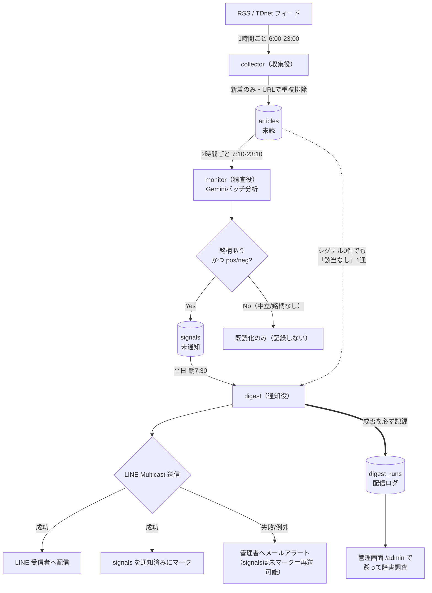

# Japan Stock Signal - 仕様書

## 概要

ニュースを起点に日本株の値動きシグナルを検出し、**取引日の朝にデイリーダイジェストとしてLINE通知**するシステム。
デイトレード向けに、前日（前回配信以降）の材料を寄付き前に整理して受け取り、その日の取引戦略に使う。

## ユースケース

- ポジティブニュース → 急騰が期待できる銘柄として寄付きからの戦略を立てる
- ネガティブニュース → 急落・リバウンド狙いの候補として監視する
- 朝7:30の通知を見て、寄付き（9:00）・PTSデイタイム（8:20〜）までに準備する

## システム構成（3エージェント + ストア）

```
[データ収集役 collector]  毎日 6:00〜23:00 JST、1時間ごと（週末も稼働）
  - RSS + TDnet(JSON)から記事を収集
  - 数値系開示(業績/配当/決算)は本文(XBRL確定値 or PDFテキスト)も収集時に取得
  - TDnet開示には権威ある証券コード・社名を付与（銘柄同定をLLM任せにしない）
  - 新着だけをストアに登録（URLで重複排除）

       ↓ articles（未読）

[データ精査役 monitor]  毎日 7:10〜23:10 JST、2時間ごと
  - 未読記事をLLMでまとめて分析（10件/リクエストのバッチ）
  - ポジ/ネガ判定 + 関連銘柄の特定 + 1行要約
  - 「銘柄が特定できたポジ/ネガ記事」だけをシグナルとして蓄積
  - 中立・銘柄なしの記事は記録せず既読化のみ

       ↓ signals（未通知）

[通知役 digest]  平日 朝7:30 JST に1回
  - 未通知のシグナルをリスト形式の1通にまとめてLINE Multicast配信
  - 配信したシグナルに通知済みマークを付ける
  - シグナルゼロの日もその旨を1通送る（無通知と障害を区別できるようにする）
```

### 収集→分析→配信フロー図



> 朝の定期配信は GitHub Actions で `collect→analyze→deliver` を直列実行（ADR-002）。
> 管理画面の「即時配信」も同じ `_run_full_pipeline` を呼ぶ。
> `digest_runs` への記録は成否によらず必ず行い（`finally`）、失敗時のみメールアラートを送る。

設計判断のポイント:

- **収集は1時間ごと**: RSS/TDnetは「直近N件」しか見えない窓（TDnet JSONは直近100件）なので、1日1回の一括取得だと窓から流れた開示を取りこぼす
- **精査は定期実行でシグナルをaddしていく**: 朝の一括分析だと配信遅延リスクがあり、Gemini無料枠（約10リクエスト/分・250リクエスト/日）にも収まらない。日中に分散し、バッチプロンプトでリクエスト数を抑える
- **分析は逐次保存・1回あたり上限**: `analyze_batch` はバッチ単位で結果をyieldし、バッチ完了ごとに保存・既読化する（再起動・再デプロイで中断されても処理済み分は確定＝二重課金しない／`INSERT OR IGNORE`で冪等）。`settings.max_articles_per_run`（既定200）で1実行の処理量を抑え、バックログは複数回の実行で漸減させる
- **配信は7:30**: 米国市場の引け（JST朝5〜6時）を受けた早朝ニュースを7時台の収集・精査で取り込んだ上で、PTSデイタイム開始（8:20）や寄付き前の準備時間を確保する
- **月曜朝は金曜朝以降の3日分**（週末のニュース含む）がまとまって届く

## 通知フォーマット（デイリーダイジェスト）

```
📋 6/12(金) 朝のシグナル 2件

✅ サムコ(6387) 🔥5
　📊 4,460円
　通期営業利益を大幅上方修正、市場予想を超過
　https://...

✅ TKP(3479) 🔥4
　📊 1,250円
　大手企業との新規大口契約を発表
　https://...
```

- 1項目 = 判定アイコン + 銘柄名(証券コード) + **🔥インパクトスコア** + 終値(値ごろ) + 1行要約 + 記事リンク
- **インパクト降順**に並べる（先頭が“今日の主役候補”）。詳細は下記「シグナルの選別」参照
- 銘柄が特定できないニュースは載せない
- **前日比%・出来高は載せない**（“旬になる直前の値＝ノイズ”のため。値ごろ感の終値のみ）
- LINEの1通上限（5,000字）を超える場合は複数通に分割
- LINE無料枠は月200通。1日1通運用なので余裕（受信者が増えても 受信者数×約21通/月）

## シグナルの選別（デイトレ最適化）

デイトレで「実際に獲れる旬の銘柄」だけを届けるための選別ロジック。設計判断の経緯は
`docs/architecture-decisions/` と git 履歴、効果測定は `scripts/verify_signals.py` 参照。

- **インパクトスコア(1〜5)**: 方向(ポジ/ネガ)とは独立に「翌営業日の出来高爆発＝旬になる可能性」を
  LLMが評価（`monitor/analyzer.py` の `_IMPACT_INSTRUCTION`、スキーマに `impact`）。
  5=黒字転換/復配/MBO/超大幅修正、4=明確な上方修正・臨床進展・大口契約、3=順当、1=大型株のマクロ連動・織込済。
  `settings.min_impact_for_notify`（既定4）以上のみ配信。未満は `notified_at` を打たず未配信のまま残す。
- **大型株フィルタ**: TOPIX Core30相当（`monitor/large_cap.py`）の全銘柄が大型のシグナルは配信除外
  （`settings.exclude_large_cap` 既定true）。マクロ連動で動かないノイズを弾く。
- **株価付与**: Yahoo Finance(chart API・httpx直叩き・新規依存なし)で生成時点の確定終値を `stocks` JSON に埋め込む。
  場中(15:10 JST前)は当日の未確定バーを除外し前営業日終値を採る。値ごろ感の表示と価格帯フィルタに使う。
- 効果測定基準（2026-06-10〜18・反応日）: 中小型ポジの値幅5%超ヒット率 全体28% → インパクト4〜5で**36%**。

> 補足: 場中のリアルタイム監視（ギャップ率・出来高ランキング）はSBI等の証券アプリに任せる。本システムの役割は
> **9:00オープン前に“今日の主役候補”を数銘柄に絞る**ことに限定する（場中の追走通知は実装しない方針）。

## 開示本文の動的分析（XBRL優先＋PDFテキスト ハイブリッド）

数値系開示（業績予想の修正・決算・配当）は、collector が収集時に本文を取得して LLM に渡す。

- **XBRL があれば**標準タクソノミタグから確定数値を抽出（前回予想↔今回・前期実績の比較、高信頼）
- **XBRL が無ければ**開示PDFの埋め込みテキストを抽出し、厳格プロンプトで上方/下方を数値比較判定させる
  （核心の「業績予想の修正」はXBRL付与が約2割のためPDFフォールバックが必須）
- OCR（画像読み取り）・自前の脆い表組みパーサは持たない。PDFは「テキスト抽出してLLMに渡すだけ」
- 実装: `collector/body_fetcher.py`（取得・テキスト化）＋ `collector/xbrl_parser.py`（XBRL構造化抽出）。
  記事の処理ルートは `articles.body_status`（`xbrl`/`pdf_text`/`title_only`/`error`）で持つ

**銘柄同定の権威化**: TDnet が返す `company_code`/`company_name` を `articles.security_code`/`security_name`
に保存し、分析時に開示会社を権威コード（5桁→4桁正規化）＋社名で確定する（`monitor/agent._reconcile_identity`）。
LLMが生成した社名のハルシネーション（コードは正でも社名が別会社）や、コード抽出漏れを補正する。

## 捕捉率フィードバック（ピックアップ精度の計測と改善提案）

本体が「市場の動意」をどれだけ拾えているかを毎営業日自動で採点し、**ピックアップロジックの
ブラッシュアップ**につなげる計測系（`feedback/` パッケージ・平日引け後 cron）。本体ロジックには触れない。

- 引け後に値上がり率ランキング上位30（中小型・非ETF）を取得（`feedback/ranking.py`、Yahoo の
  `__PRELOADED_STATE__` を httpx 取得）し、自システムの当日処理と突き合わせる
- 各銘柄を `delivered`（ニュース版で配信済）/ `delivered_technical`（テクニカル版で配信済）/
  `signaled_not_delivered`（拾ったが未配信）/ `analyzed_neutral`（分析したが中立で落とした）/
  `not_collected`（収集網の外）に分類
- **捕捉率**は2チャンネル合算（(delivered + delivered_technical) / 母集団）。テクニカル版は寄り前に
  実行されFB窓の内側に入るため、配信成功(`line_ok>0`)した `technical_runs` の picks を合算する
  （`captured_tech` に別記録）。支配的な取りこぼしクラスから改善レバー（収集網拡張・中立基準見直し・
  閾値チューニング 等）を提案し、`coverage_runs` に保存して管理画面に表示
- 出力は助言で、ロジックは自動変更しない（人が判断して別途反映）

## テクニカル版 朝のシグナル（価格/出来高駆動の別系統）

ニュース/開示を伴わないテーマ・需給・モメンタム駆動の動意は本体（ニュース起因）の対象外のため、
**独立した第2系統**として配信する（`technical/` パッケージ・平日朝8:00 JST cron）。本体ロジックには触れない。

- 値上がり率ランキング上位30（中小型・非ETF）のうち「**値上がり率≥5% かつ 出来高急増≥2倍**
  （当日出来高 / 直近4営業日平均、`monitor/quotes.py`）」の複合条件で抽出
- **本体digest（7:30）の後に実行**し、本体が当日配信した銘柄は除外（二重配信防止）。寄り前に届ける
- 本体（✅/❌＋🔥）と区別した「📊 テクニカル注目」LINE。値動きが主役なので前日比%・出来高倍率を明示
- 閾値は settings（`tech_min_change_pct` / `tech_min_volume_surge` / `tech_top_n` / `tech_dedup_with_news`）で調整可。`technical_runs` に配信記録

## ストア（Cloudflare D1）

| テーブル | 役割 | 主なカラム |
|---|---|---|
| articles | 収集した記事 | title, body, url(UNIQUE), fetched_at, is_read, security_code/security_name(開示の権威コード・社名), body_status, full_body, xbrl_metrics, correction_reason |
| signals | 検出したシグナル | article_id(UNIQUE), sentiment, summary, stocks(JSON・終値等を含む), url, impact(1〜5), created_at, notified_at |
| article_analyses | 分析結果（一覧/絞り込み用） | article_id(UNIQUE), sentiment, summary, reason, stocks(JSON), became_signal, impact |
| digest_runs | 配信実行ログ | status, signal_count, line_ok/error, error_detail, notified_ids(JSON), run_at |
| coverage_runs | 捕捉率フィードバックの記録 | ranking_date, ranking_type, top_n, universe, captured/captured_tech/signaled/neutral/not_collected, capture_rate, detail(JSON), proposal |
| technical_runs | テクニカル版の配信記録 | target_date, status, pick_count, line_ok/error, picks(JSON), error_detail |
| recipients | LINE受信者 | line_user_id(UNIQUE), followed_at |

- D1はSQLite互換。store層は `CLOUDFLARE_*` 環境変数があればD1 REST API、なければローカルSQLite（開発用）
- マイグレーションは `migrations/*.sql` をファイル名順に実行（冪等）

## 情報源（RSS）

| ソース | URL |
|---|---|
| Yahoo!ニュース ビジネス | https://news.yahoo.co.jp/rss/topics/business.xml |
| TDnet 適時開示（やのしんWEB-API・JSON） | https://webapi.yanoshin.jp/webapi/tdnet/list/recent.json?limit=100 |
| NHK 経済 | https://www.nhk.or.jp/rss/news/cat6.xml |

## インフラ（すべて無料枠）

| 役割 | サービス |
|---|---|
| DB | Cloudflare D1 |
| 定期実行（収集/精査/配信/捕捉率FB/テクニカル版/掃除） | GitHub Actions schedule（publicリポジトリのため無制限。collector/monitor/digest/feedback/technical/cleanup の6ワークフロー） |
| LINE Webhookサーバー（受信者管理） | Render Free Web Service |
| LLM | Gemini API（既定 gemini-2.5-flash、管理画面で変更可） |

## 将来の拡張候補（未実装）

- [ ] 銘柄ごとのグルーピング（同一銘柄が複数シグナルに跨る場合のまとめ表示。現状はシグナル＝ニュース単位）

> 実装済み: 影響度スコア(1〜5)による重要度順配信＝「シグナルの選別」／開示の数値分析＝「開示本文の動的分析」／
> 銘柄同定の権威化（TDnet社名＋Yahooコード実在検証）／捕捉率フィードバック／テクニカル版 朝のシグナル／
> TDnet取得の障害アラート（連続失敗でメール）／データ保持・ローテーション（下記）／
> TDnetタイトル事前フィルタ（下記）／株価チャートへのリンク付与（LINEダイジェスト・管理画面の各銘柄に
> Yahoo!ファイナンスのチャートリンク 📈 を付与。`quotes.chart_page_url`）。
> 方針決定（コード変更なし）: Renderコールドスタート対策＝外部無料pingerで `/health` を warm 保持（ADR-005）。
> 破棄: 場中の即時/追走通知（証券アプリの劣化版になり特別気配の判定も困難なため。同節の補足参照）。
> 見送り: **X(旧Twitter)の株クラ・センチメント指標**（当初からの希望機能だが本システムの無料インフラ方針と非対称なコスト構造のため）。
>   2026-06-24時点の調査では X API の無料枠は実質廃止＝検索不可（読み取り 約1req/15分・投稿1,500件/月のみでセンチメント収集に使えない）。
>   新規開発者は従量課金（$0.005/読み取り・月200万件上限）か Enterprise（約$42,000/月〜）の二択。旧 Basic($200/月)/Pro($5,000/月)は既存契約者限定で新規不可。
>   従量課金でも実用的な常時監視は月数百ドル規模になり、全経路を無料インフラで回す本システムの前提に合わないため**今回は実装しない**。
>   無料の代替源（Yahoo!掲示板・みんかぶ等）や有料前提の再検討は将来の経営判断に委ねる。

### データ保持・ローテーション（実装済み）

DBの肥大化と全期間スキャンの重さを抑えるため、価値の低い記事を保持期間経過後に削除する。

- **削除対象**: `sentiment='neutral'` かつ 紐づく銘柄なし(`stocks` が `[]`/空) かつ `fetched_at` が保持期間より古い記事のみ。
  signals 化したもの・pos/neg・銘柄あり・未読(分析待ち)は残す。`signals` 参照は二重防御で除外。
- **保持期間**: 既定90日（`settings.retention_days` で変更可）。
- **方式**: 条件直接DELETE（フラグ2段階は採らない）。該当 `article_analyses` を消し、続いて分析もシグナルも無い古い既読 `articles` を消す。
  削除件数をログ出力して silent な削除を避ける。
- **実行**: `maintenance.cleanup` を GitHub Actions `cleanup.yml` が週次（日曜深夜 JST）に起動。計測専用ではなく書き込み（削除）役だが、収集・分析・配信ロジックには干渉しない。

### TDnetタイトル事前フィルタ（実装済み・既定OFF）

未読バックログの肥大化（Geminiレート制限で分析が追いつかない）と LLM コストを抑えるため、
非材料の定型TDnet開示を**LLM分析前に**タイトルで除外する（`monitor.agent`）。

- **対象**: TDnet開示（url が `tdnet.info`）のみ。RSSニュースには適用しない（タイトルが多様で誤除外リスクが高い）。
- **判定**: `settings.tdnet_title_prefilter_denylist`（改行区切り）のタイトル部分一致。除外分は neutral・銘柄なし・impact=1 で確定し既読化（バックログから外す）。
- **既定OFF**: `settings.tdnet_title_prefilter_enabled`。捕捉率（FBで4%・ボトルネックは収集網の外）を下げないよう、有効化と denylist 調整は管理画面の収集設定から行う。除外件数はログ出力（silent除外を避ける）。
- **方針**: denylist には材料性のない定型・手続き開示（ガバナンス報告書・各種報告書・招集通知・買付状況報告書・説明会資料等）のみを保守的に列挙。修正・決算・配当・提携等は決して入れない。
